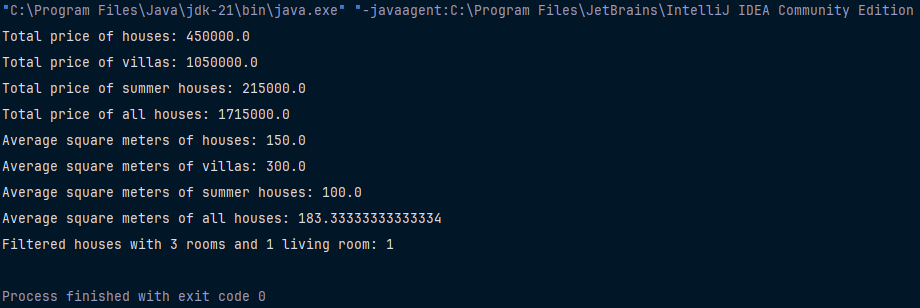

# Ev Yönetim Sistemi

Bu ödev, farklı ev tiplerini (ev, villa, yazlık) yöneten ve çeşitli hesaplamalar yapan bir Java uygulamasıdır.

## Proje Yapısı

Ödev, n-katmanlı mimari kullanılarak geliştirilmiştir: 

## Özellikler

Sistem aşağıdaki işlevleri sunar:

- Ev, villa ve yazlık tiplerinin toplam fiyatlarının hesaplanması
- Tüm konutların toplam fiyatının hesaplanması
- Her konut tipi için ortalama metrekare hesaplaması
- Tüm konutların ortalama metrekare hesaplaması
- Oda ve salon sayısına göre konut filtreleme

## Kullanılan Teknolojiler
- Java
- Nesne Yönelimli Programlama
- Clean Code prensipleri
- N-Katmanlı Mimari

## Çıktı Görüntüsü

